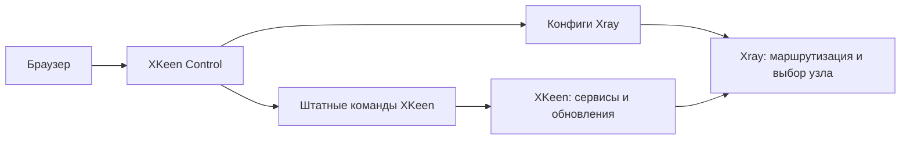

<div align="center">

# XKeen Control

### Ваш VPN на Keenetic — наглядно, в браузере

Узлы, подписки, маршрутизация и штатные команды XKeen в одной лёгкой панели.

[](https://github.com/popiposter/xkeen-control/releases/latest)
[](docs/QUICKSTART-RU.md)
[](docs/UI-DESIGN.md)

[Установить](#установка) · [Быстрый старт](docs/QUICKSTART-RU.md) · [Документация](docs/README.md) · [Релизы](https://github.com/popiposter/xkeen-control/releases) · [Задачи](https://github.com/popiposter/xkeen-control/issues)

</div>

---

**XKeen работает штатно. Панель работает рядом.** Она вызывает встроенные команды, помогает редактировать конфиги Xray и показывает состояние VPN. Скрипты XKeen, его установщик и расписания остаются под управлением самого XKeen.

## Что можно делать

| | Возможности |
| --- | --- |
| 🌍 **Узлы и подписки** | Добавлять VLESS/REALITY, обновлять подписки, включать и отключать узлы, видеть страну, здоровье и результаты измерений. Ручное отключение сохраняется после обновления; WL, Россия и Беларусь выключены по умолчанию. |
| ⚡ **Качество соединения** | Проверять скорость кандидатов с актуальной задержкой, получать сбалансированный пул до шести узлов и явно применять рекомендацию. Дальнейший выбор и failover выполняет Xray. |
| 🧭 **Маршрутизация** | Направлять домены, IP, категории geodata и другие типы правил через VPN, напрямую или в блокировку. Искать категории в установленных базах и видеть порядок правил. |
| 📝 **Конфиги** | Переключаться между формой и текстом с подсветкой JSON/JSONC, форматировать, отменять правки, сохранять черновик. Общий набор изменений проходит проверку Xray и применяется одним явным перезапуском. |
| 🛠️ **Штатный XKeen** | Запускать сервисные команды, обновление компонентов и настройку расписаний. Видеть исходный консольный вывод и отвечать на интерактивные вопросы. |
| 🛡️ **DNS** | Редактировать DNS Xray. При отдельно установленном LAN-резолвере синхронизировать доменную политику: DIRECT независимо от Xray, VPN через VPN без прямого fallback. |
| 📦 **Перенос настроек** | Создавать зашифрованный экспорт, проверять импорт и сопоставлять интерфейсы перед применением. |
| 🔔 **Telegram** | Подключать уведомления и ограниченное управление для одного разрешённого пользователя и чата. |

Светлая и тёмная темы, адаптивный интерфейс, запоминаемая авторизация. На роутере — один готовый Go-бинарник со встроенным интерфейсом; Go, Node и Docker там не нужны.

## Установка

Нужны **Keenetic с `linux/arm64`, Entware в `/opt` и уже установленный штатный XKeen с Xray**. Сначала установите XKeen его официальным способом и проверьте обычную работу. Панель не устанавливает и не исправляет его компоненты самостоятельно.

Установка опубликованного стабильного **0.3.1**:

```sh
sh -c "$(curl -fsSL https://github.com/popiposter/xkeen-control/releases/download/v0.3.1/install.sh)"
```

Первый пароль панели генерируется и выводится в терминал установщика. Панель по умолчанию слушает `127.0.0.1:8787`. Для первого входа можно открыть SSH-туннель с компьютера:

```sh
ssh -L 8787:127.0.0.1:8787 root@<адрес-роутера>
```

Затем откройте **http://localhost:8787**. Для постоянного доступа настройте один доверенный LAN-адрес панели. Не публикуйте её в WAN.

> Установщик относится к панели. Независимый LAN DNS требует отдельно настроенного резолвера и DNS-профиля Keenetic. Старые appliance/takeover-установки не входят в текущий контракт совместимости.

## Первые пять минут

1. **Добавьте подписку или ключи** в Nodes. Проверьте включённые узлы.
2. **Настройте правила** в Routing и DNS. Сохраните конфиги и примените общий набор изменений.
3. **Запустите тест скорости**. Он проверяет расширенную выборку, а не только действующий пул; примените свежую рекомендацию, если результат подходит.
4. **Проверьте Overview**: сервисы, активный пул и текущее состояние соединения.
5. **Сохраните зашифрованную копию** перед дальнейшими настройками.

Рейтинг теста не закрепляет первый узел навсегда. Xray продолжает выбирать внутри применённого пула по живому состоянию и настройкам балансировки. Изменение подписок или конфигов делает старую рекомендацию неактуальной.

## Как устроено



Выключение панели не выключает работающий Xray. Обновление подписок и синхронизация DNS, которые выполняет панель, возобновляются при её запуске; DNS-резолвер продолжает обслуживать последний успешный набор правил.

## Документация и развитие

Начните с [быстрого старта](docs/QUICKSTART-RU.md) или [каталога документации](docs/README.md). Для разработчиков: [сборка и проверки](docs/DEVELOPMENT.md), [архитектура](docs/ARCHITECTURE.md), [план развития](docs/ROADMAP.md).

Стабильный 0.3.1 опубликован после ревью, полного прогона 106 браузерных тестов и независимой проверки семи подписанных файлов. Проверки публикации и development-установки не означают, что подписанный 0.3.1 уже установлен на операторском роутере. Оставшиеся аппаратные проверки вынесены в отдельные [задачи](docs/ROADMAP.md).

Нашли проблему? [Создайте issue](https://github.com/popiposter/xkeen-control/issues/new) с версией, шагами и обезличенной ошибкой. Не прикладывайте ссылки подписок, VPN-ключи, пароли, приватные консольные логи или архивы настроек. Подробнее — [SECURITY.md](SECURITY.md).
