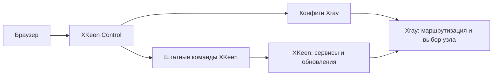

<div align="center">

# XKeen Control

### Ваш VPN на Keenetic — наглядно, в браузере

Узлы, подписки, маршрутизация и штатные команды XKeen в одной лёгкой панели.

[](https://github.com/popiposter/xkeen-control/releases/latest)
[](docs/QUICKSTART-RU.md)
[](docs/UI-DESIGN.md)

[Установить](#установка) · [Быстрый старт](docs/QUICKSTART-RU.md) · [Документация](docs/README.md) · [Релизы](https://github.com/popiposter/xkeen-control/releases) · [Задачи](https://github.com/popiposter/xkeen-control/issues)

</div>

---

**XKeen работает штатно. Панель работает рядом.** Она вызывает встроенные команды, помогает редактировать конфиги Xray и показывает состояние VPN. Скрипты XKeen, его установщик и расписания остаются под управлением самого XKeen.

## Что можно делать

| | Возможности |
| --- | --- |
| 🌍 **Узлы и подписки** | Добавлять VLESS/REALITY, обновлять подписки, включать и отключать узлы, видеть страну, здоровье и результаты измерений. Ручное отключение сохраняется после обновления; WL, Россия и Беларусь выключены по умолчанию. |
| ⚡ **Качество соединения** | Проверять скорость кандидатов с актуальной задержкой, получать сбалансированный пул до шести узлов и явно применять рекомендацию. Дальнейший выбор и failover выполняет Xray. |
| 🧭 **Маршрутизация** | Направлять домены, IP, категории geodata и другие типы правил через VPN, напрямую или в блокировку. Искать категории в установленных базах и видеть порядок правил. |
| 📝 **Конфиги** | Переключаться между формой и текстом с подсветкой JSON/JSONC, форматировать, отменять правки, сохранять черновик. Общий набор изменений проходит проверку Xray и применяется одним явным перезапуском. |
| 🛠️ **Штатный XKeen** | Запускать сервисные команды, обновление компонентов и настройку расписаний. Видеть исходный консольный вывод и отвечать на интерактивные вопросы. |
| 🛡️ **DNS** | Редактировать DNS Xray. При отдельно установленном LAN-резолвере синхронизировать доменную политику: DIRECT независимо от Xray, VPN через VPN без прямого fallback. |
| 📦 **Перенос настроек** | Создавать зашифрованный экспорт, проверять импорт и сопоставлять интерфейсы перед применением. |
| 🔔 **Telegram** | Подключать уведомления и ограниченное управление для одного разрешённого пользователя и чата. |

Светлая и тёмная темы, адаптивный интерфейс, запоминаемая авторизация. На роутере — один готовый Go-бинарник со встроенным интерфейсом; Go, Node и Docker там не нужны.

## Установка

Опубликованный стабильный релиз — **0.4.6**, с пакетами ARM64 и MIPS soft-float. Выберите установку нового роутера или только панели.

### Новый роутер

Первый поддержанный вариант: **Ultra KN-1811, KeeneticOS 5.01.C.6.0-1, `linux/arm64`** с рабочим Entware `/opt`, одним домашним IPv4 bridge и одним WAN. XKeen, панель и LAN-резолвер ещё не установлены; нет host-исключений и custom DNS-профилей. Нужны `curl`, `jq`, `sha256sum`, `flock`, `stat`, `sync -f`, `timeout -k` и не менее 128 MiB свободной памяти и места в `/opt`. Другие модели, прошивки и топологии этот режим пока не поддерживает.

```sh
xkeen_installer=$(curl -fsSL https://github.com/popiposter/xkeen-control/releases/download/v0.4.6/install.sh) && sh -c "$xkeen_installer" -- --setup
```

Установщик приватно запросит подписку или VLESS-узел, проверит/установит GNU tar, подготовит штатный XKeen 2.1, Xray, панель и mosdns. Он создаёт политику доступа и DNS-профиль через фиксированные команды Keenetic, применяет эталон RU selective и подключает всю HOME-сеть после проверок VPN/DNS и сохранения настроек. Ссылку вводите по запросу, не добавляйте в команду. [Порядок и восстановление установки](docs/FRESH-KEENETIC.md).

### Уже установленный XKeen

Для Keenetic `linux/arm64` или `linux/mipsle` soft-float с Entware и работающим штатным XKeen/Xray установите только панель. Для Ultra KN-1810 с Entware `mipsel-3.4`/`mipsel-3.4_kn` пакет выбирается автоматически; сначала выполните [подготовку и резервное копирование](docs/MIPS-KEENETIC.md). Аппаратная приёмка KN1810 ещё не завершена; `--setup` для него не поддерживается.

```sh
xkeen_installer=$(curl -fsSL https://github.com/popiposter/xkeen-control/releases/download/v0.4.6/install.sh) && sh -c "$xkeen_installer"
```

Этот режим сохраняет существующие настройки и не создаёт HOME-политику или эталон. Для уже управляемой панели используйте подписанное обновление в System → Panel. `--setup` поверх существующей установки запускать не нужно.

Первый пароль панели выводится в терминал. После `--setup` там же указан доверенный домашний адрес панели. При установке только панели она по умолчанию слушает `127.0.0.1:8787`; для первого входа откройте SSH-туннель с компьютера:

```sh
ssh -L 8787:127.0.0.1:8787 root@<адрес-роутера>
```

Затем откройте **http://localhost:8787**. Для постоянного доступа настройте один доверенный LAN-адрес панели. Не публикуйте её в WAN.

> При установке только панели независимый LAN DNS требует отдельно настроенного резолвера и DNS-профиля. Fresh `--setup` готовит их сам в поддержанном варианте. Старые appliance/takeover-установки не входят в текущий контракт совместимости.

## Первые пять минут

1. **Проверьте узлы** в Nodes. После `--setup` подписка/узел уже добавлены; при установке только панели добавьте их сами.
2. **Настройте правила** в Routing и DNS. Сохраните конфиги и примените общий набор изменений.
3. **Запустите тест скорости**. Он проверяет расширенную выборку, а не только действующий пул; примените свежую рекомендацию, если результат подходит.
4. **Проверьте Overview**: сервисы, активный пул и текущее состояние соединения.
5. **Сохраните зашифрованную копию** перед дальнейшими настройками.

Рейтинг теста не закрепляет первый узел навсегда. Xray продолжает выбирать внутри применённого пула по живому состоянию и настройкам балансировки. Изменение подписок или конфигов делает старую рекомендацию неактуальной.

## Как устроено



Выключение панели не выключает работающий Xray. Обновление подписок и синхронизация DNS, которые выполняет панель, возобновляются при её запуске; DNS-резолвер продолжает обслуживать последний успешный набор правил.

## Документация и развитие

Начните с [быстрого старта](docs/QUICKSTART-RU.md) или [каталога документации](docs/README.md). Для разработчиков: [сборка и проверки](docs/DEVELOPMENT.md), [архитектура](docs/ARCHITECTURE.md), [план развития](docs/ROADMAP.md).

Стабильный 0.4.6 опубликован после независимого ревью точного источника, полного защищённого прогона с браузерными тестами и проверки десяти файлов с двумя подписанными манифестами. Опубликованный MIPS-бинарник прошёл проверку static soft-float и запуск под эмулятором. Подписанная панель 0.4.5 установлена на KN1810; установка 0.4.6, завершение сохранённой операции с узлами, свежая установка, независимый LAN/IPv6 и отказ upstream ещё не проверены; опубликованный релиз не означает его установку на операторский роутер. [Границы приёмки](docs/ROADMAP.md).

Нашли проблему? [Создайте issue](https://github.com/popiposter/xkeen-control/issues/new) с версией, шагами и обезличенной ошибкой. Не прикладывайте ссылки подписок, VPN-ключи, пароли, приватные консольные логи или архивы настроек. Подробнее — [SECURITY.md](SECURITY.md).
