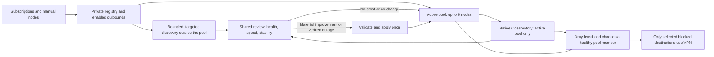

# Introduction

This is the **target**, not a description of the installed 0.4.12 behavior. The
same node lifecycle, scheduling, selection and automatic Apply policy must run
on KN1811/ARM64 and KN1810/MIPS. The hardware profile changes only how the
active pool is observed (parallel or sequential) and how broad/large a speed
comparison can be. It must not change when a review is due, how a winner is
chosen, or whether a verified recommendation is applied.
Track the implementation in [#199](https://github.com/popiposter/xkeen-control/issues/199).

## 1. Requirements & Constraints

- **REQ-001**: Keep one shared scheduler, shortlist, score, decision and Apply
  path. A complete, verified automatic review may apply one changed pool on
  either architecture. A manual speed test presents a recommendation for
  explicit Apply; it does not masquerade as a complete automatic review.
- **REQ-002**: The native `bal-proxy` selector contains at most six distinct,
  enabled, exact managed outbounds. Fill six when six qualified nodes exist;
  fewer remain explicitly partial. The private registry is the node/subscription
  authority. Xray `leastLoad` uses native health, RTT and saved costs within
  this pool. Existing connections need not migrate when its selected member
  changes. The panel does not pin a single winner.
- **REQ-003**: Native Observatory observes **only** the resolved active pool,
  never every enabled subscription node. Because `subjectSelector` uses prefix
  matching, validate that its entries resolve to exactly the intended tags;
  reject ambiguous prefix overlap. ARM64: concurrent probes, initial interval
  30 seconds. MIPS: sequential probes, initial interval 10 seconds. Derive
  freshness from the real matched count and cycle time; tune these two initial
  intervals only after controlled hardware measurements.
- **REQ-004**: Enabled nodes outside the pool remain loaded in Xray and are
  discovered by sequential, targeted, low-payload probes through the existing
  shared `ProbeRouter` owner. Discovery runs after an actual membership change,
  when fewer than two pool members are freshly healthy, and in a rotating daily
  inventory pass. Cap the daily pass at 64 nodes and each probe at 10 seconds /
  1 KiB; continue the cursor on the next day. Record targeted evidence with its
  own timestamp and 24-hour expiry. Never present it as Observatory data or
  throughput. If fewer than six candidates are discovered, report coverage and
  the partial pool honestly.
- **REQ-005**: Refresh subscriptions sequentially on the common existing
  six-hour cadence plus per-subscription jitter. A failed fetch retains the
  previous known registry/outbounds. A successful no-op refresh does not launch
  discovery or speed comparison. A material membership/credentials change may
  schedule one coalesced review after its own transaction is settled. Ordinary
  subscription refresh never silently edits routing or DNS.
- **REQ-006**: Use one common regular review policy: at most one automatic
  speed review per rolling 24 hours, at least six hours between comparison
  starts, triggered by changed eligible nodes, sustained pool degradation or
  a daily due review. Do not launch a new speed test merely because the panel
  restarted. Persist the last-start/quota/fence state across panel restarts.
  Discovery and Observatory do not consume speed-test quota.
- **REQ-007**: A regular review freezes one candidate set: current healthy
  incumbents, recently discovered challengers and a rotating share of the
  remaining enabled nodes. Attempt every selected candidate; require at least
  80% fresh valid results and six valid results before replacing a full healthy
  pool. Preserve a healthy incumbent with invalid speed data. Replace a
  healthy incumbent only when measured score improves by at least 15%; replace
  an explicitly unhealthy member with a freshly verified candidate. Do not
  claim a global best when the review covers only a subset.
- **REQ-008**: Speed-test breadth is the only measurement-budget difference.
  Initial **proposed ceilings**, subject to hardware acceptance: ARM64 up to
  24 candidates, 288 MiB and 10 minutes per regular review; MIPS up to 12
  candidates, 48 MiB and 10 minutes, sequential batches of at most three.
  Failed and partial transfers count. Both profiles use the same admission,
  pressure cancellation, freshness, coverage, score, quota and Apply rules.
  Initially require at least 64 MiB available memory on either router; refuse
  when two consecutive CPU samples are each at least 85% busy or swap-out
  exceeds 1 MiB/s, and cancel after three consecutive pressured samples.
  These ceilings are maxima, not promised traffic use or proven optimums.
- **REQ-009**: If no selected member is freshly healthy, run bounded targeted
  discovery immediately, without waiting for the next speed review. A
  candidate verified by actual outbound routing may form a labelled
  **provisional** pool of one to six members after full configuration and native
  runtime validation; this is availability recovery, not a speed ranking.
  If no candidate or no proof exists, leave the current configuration intact,
  report VPN unavailable and keep the existing `block` fallback for proxied
  destinations. No silent DIRECT leak or repeated restart loop.
- **REQ-010**: Before any changed pool is applied, verify registry/outbound/
  routing identities, pending-free editor state, health/probe cleanup and
  resource admission. Use the fixed routing editor, full Xray validation and
  one native Apply; prove its terminal receipt, process and runtime selector.
  An unknown result fences later automatic work for inspection. A no-change
  recommendation does not restart Xray. Subscription churn and imported legacy
  pools use their separate issue contracts (#194 and #198).
- **REQ-011**: UI distinguishes total/enabled/discovered/tested nodes,
  configured pool, measured recommendation, verified applied pool and current
  native-selected member. Show the review trigger, coverage, consumed budget,
  next due time, last Apply proof and why work was deferred. An out-of-pool
  member is labelled "not continuously monitored" with its last discovery
  time; `No data` is not the same as a failed probe.
- **CON-001**: Preserve the compact routing policy: only the intended blocked
  destinations use `bal-proxy`; Russian domains/IPs, torrents and other traffic
  remain DIRECT. Use ordinary Keenetic DNS; no mosdns, DNS interception or DNS
  over VLESS. Stock XKeen code, init and component ownership stay unchanged.
- **SEC-001**: Keep subscription URLs, node credentials, full native configs
  and raw probe/benchmark responses private. Public evidence contains only
  bounded counts, state, versions and hashes. Probe traffic uses only the
  loopback `probe` inbound and must prove the requested outbound was used.

## 2. Implementation Steps

### Implementation Phase 1

- GOAL-001: Unify the scheduler and make the active pool observable without
  scanning the whole registry continuously. Depends on #194 and #198 for their
  exact churn/imported-pool states.

| Task | Description | Completed | Date |
| --- | --- | --- | --- |
| TASK-001 | Refactor `internal/nativequality/schedule.go` so both profiles use one due-time and review/auto-Apply path. In `internal/nodes/refresher.go`, notify only on a committed material change. Reuse one durable last-start/quota/inspection owner for both profiles. | | |
| TASK-002 | Constrain `07_observatory.json` to the resolved selected pool through fixed native config editing; validate prefix resolution against `04_outbounds.json` before and after Apply. Update `internal/nativequality/criteria.go` to calculate freshness for the actual six-or-fewer targets. | | |
| TASK-003 | Add bounded targeted discovery through the existing `internal/c1/probe.go` owner and Coordinator. Use a managed probe-rule tag, exact outbound readback, fixed 1 KiB/10-second request, distinct timestamped discovery evidence, cursor and cleanup fence. Update `internal/nativequality/service.go` to admit fresh targeted evidence without calling it native Observatory health. | | |

### Implementation Phase 2

- GOAL-002: Apply one common quality decision with profile-specific transfer
  ceilings. Depends on GOAL-001.

| Task | Description | Completed | Date |
| --- | --- | --- | --- |
| TASK-004 | Unify `internal/nativequality/sweep.go`, `subset.go`, `pool_decision.go` and `auto_apply.go` for ARM64/MIPS. Preserve the fair rotating cursor and one verified Apply. Cap candidates/bytes/wall/batch size via `internal/resourcepolicy/policy.go` only. | | |
| TASK-005 | Add a distinct no-healthy-member recovery branch that can validate and apply one to six freshly probed members without a speed score. Keep its receipt, reason and later regular speed review distinct from an optimized pool. | | |
| TASK-006 | Update Performance, Nodes and Overview status to expose configured, recommended, verified applied and provisional states, coverage and due/deferral reasons. Do not represent saved legacy weights as measured throughput. | | |

### Implementation Phase 3

- GOAL-003: Qualify behavior before release. Depends on GOAL-002.

| Task | Description | Completed | Date |
| --- | --- | --- | --- |
| TASK-007 | Test complete/partial/no-op subscription changes, mixed healthy/unhealthy/unknown observations, 52-node discovery rotation, pool loss, identical recommendation, uncertain cleanup/Apply and restart durability in focused fixtures. Run one exact-HEAD `scripts/dev-check.ps1 -Full` and independent review. | | |
| TASK-008 | On both router types, first measure read-only baseline and a bounded unsigned synthetic candidate without changing live routing. After a signed reviewed build, inspect live state, observe one natural review and verify actual resource peaks, pool membership, VPN/DNS/browser behavior and rollback availability. Report any unrun live path as NOTRUN. | | |

## 3. Alternatives

- **ALT-001**: Observe all enabled nodes continuously. Rejected for the target:
  with 52 sequential targets even a 30-second interval yields a roughly
  31-minute native cycle and exceeds the current 15-minute freshness bound.
- **ALT-002**: Keep different selection/Apply policies for MIPS and ARM64.
  Rejected: the operator expects one behavior; hardware capacity should only
  determine observation concurrency and speed-test breadth.
- **ALT-003**: Run periodic full speed tests after every subscription refresh.
  Rejected: no-op refreshes provide no new candidates and spend traffic/CPU.

## 4. Dependencies

- **DEP-001**: [#194](https://github.com/popiposter/xkeen-control/issues/194)
  defines safe handling when a subscription removes a selected member.
- **DEP-002**: [#198](https://github.com/popiposter/xkeen-control/issues/198)
  defines explicit first initialization of an imported legacy pool.
- **DEP-003**: The existing Xray API `probe` inbound, shared `ProbeRouter`,
  editor/Jobs transaction and stock XKeen lifecycle remain available.

## 5. Files

- **FILE-001**: `internal/nativequality/{schedule,criteria,service,sweep,subset,pool_decision,auto_apply}.go` — shared observation, review and Apply.
- **FILE-002**: `internal/c1/{probe,coordinator,benchmark}.go` and `internal/resourcepolicy/policy.go` — targeted probes and bounded speed profiles.
- **FILE-003**: `internal/nodes/refresher.go` — change-aware scheduling signal.
- **FILE-004**: `config/xray/{05_routing,07_observatory}.json` and the corresponding fixed-editor preparation — pool/observation consistency.
- **FILE-005**: `web/src/main.jsx`, `docs/{ARCHITECTURE,NODE-LIFECYCLE,ROUTER-RESOURCES}.md` — truthful status and current-versus-target documentation.

## 6. Testing

- **TEST-001**: Both profiles produce the same trigger, candidate order,
  recommendation and Apply decision from identical evidence; only concurrency
  and speed limits differ.
- **TEST-002**: Verify that Observatory resolves exactly the active pool;
  targeted outsider probes do not alter selected routes and leave no probe rule.
- **TEST-003**: A no-op refresh and panel restart consume zero speed budget;
  a changed refresh coalesces one due review within shared limits.
- **TEST-004**: With all six selected nodes down, one verified outsider can
  restore a provisional VPN route; absent proof retains `block`, never DIRECT.
- **TEST-005**: Hardware measurements on both routers establish actual CPU,
  memory, swap, probe cycle, test duration/bytes and independent client reachability
  before replacing the initial numeric ceilings.

## 7. Risks & Assumptions

- **RISK-001**: Xray `subjectSelector` matches prefixes, not exact tags. A
  prefix collision must refuse narrow Observatory configuration before Apply.
- **RISK-002**: A targeted probe rule is appended. Earlier user routing could
  intercept it; uncertain AddRule/RemoveRule outcomes require readback and
  inspection, not an inferred healthy candidate or automatic retry.
- **RISK-003**: Six sequential MIPS probes can still be slow under timeout;
  the 10-second interval and 64-node/day discovery cap are starting values,
  not measured hardware conclusions.
- **ASSUMPTION-001**: Enabled managed outbounds outside the selector remain
  loaded in Xray and can be probed through the existing loopback API without
  restarting native service. Validate this on both router types.

## 8. Related Specifications / Further Reading

- [Current architecture](../docs/ARCHITECTURE.md), [node lifecycle](../docs/NODE-LIFECYCLE.md), [resource evidence](../docs/ROUTER-RESOURCES.md), [security](../SECURITY.md).
- [Xray Observatory](https://xtls.github.io/en/config/observatory.html): prefix selectors and parallel/sequential probe intervals.
