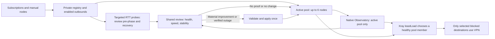

# Introduction

This is the **target**, not a description of the installed 0.4.12 behavior. The
same node lifecycle, scheduling, selection and automatic Apply policy must run
on KN1811/ARM64 and KN1810/MIPS. The hardware profile changes only how the
active pool is observed (parallel or sequential) and how broad/large a speed
comparison can be. It must not change when a review is due, how a winner is
chosen, or whether a verified recommendation is applied.
Track the implementation in [#199](https://github.com/popiposter/xkeen-control/issues/199).

## 1. Requirements & Constraints

- **REQ-001**: Keep one shared scheduler, shortlist, score, decision and Apply
  path. A complete, verified automatic review may apply one changed pool on
  either architecture. A manual speed test presents a recommendation for
  explicit Apply; it does not masquerade as a complete automatic review.
- **REQ-002**: The native `bal-proxy` selector contains at most six distinct,
  enabled, exact managed outbounds. Fill six when six qualified nodes exist;
  fewer remain explicitly partial. The private registry is the node/subscription
  authority. Xray `leastLoad` uses native health, RTT and saved costs within
  this pool. Existing connections need not migrate when its selected member
  changes. The panel does not pin a single winner.
- **REQ-003**: Native Observatory observes **only** the resolved active pool,
  never every enabled subscription node. Because `subjectSelector` uses prefix
  matching, validate that its entries resolve to exactly the intended tags;
  reject ambiguous prefix overlap. Use the same initial `probeInterval: 10s`
  on both routers; ARM64 sets `enableConcurrency: true`, MIPS sets it to
  `false`. Derive freshness from the real matched count and cycle time; tune
  the common interval only after controlled hardware measurements. An exact
  selector whose enabled outbound disappeared (subscription churn) is an
  **unhealthy member**: the node transaction keeps `05`/`07` byte-for-byte, the
  next review replaces it, and zero healthy members triggers REQ-009. No
  separate degraded-state receipt exists. Any selector that is not the target
  shape (broad prefix, imported legacy pool, orphaned members) is labelled
  unoptimized and takes the same first-review path; there is no one-time
  initialization intent. Fresh setup should prepare a bounded initial selector;
  an installed broad selector moves to one validated 05+07 Apply only after a
  usable member is proven, retaining the inspected previous configuration.
  This replaces the separate contracts of #194 and #198.
- **REQ-004**: Enabled nodes outside the pool remain loaded in Xray and are
  reached by sequential, targeted, low-payload RTT probes through the existing
  shared `ProbeRouter` owner (10 seconds / 1 KiB each). There is no standalone
  inventory pass, discovery store or discovery cursor. Probes run only (a) as
  the pre-phase of a review, for exactly the frozen candidates of REQ-007, and
  (b) during REQ-009 recovery. Their results live in that review's or
  recovery's evidence and are never presented as Observatory data or
  throughput. If fewer than six candidates qualify, report coverage and the
  partial pool honestly. Probe rules are Xray in-memory state that match only
  the loopback `probe` inbound, so no durable fence is needed. Reconcile every
  managed probe tag at panel start and before each probe run. An uncertain
  install/cleanup skips that probe and marks the review incomplete.
  Today the only startup reconcile is in `c1.Supervisor.Start`, which never
  runs (`Coordinator.Start` is never called), so the live startup path must
  add it.
- **REQ-005**: Refresh subscriptions sequentially on the common existing
  schedule: a jittered first start, then six hours after each completed
  attempt. A failed fetch retains the previous known registry/outbounds.
  Neither an automatic nor a manual no-op refresh launches discovery or speed
  comparison. Every settled effective enabled membership/credential change,
  including manual add, enable, disable and delete, emits one change-aware
  signal after commit; metadata-only edits do not. Coalesce signals into one
  bounded review. Node/subscription changes never silently edit routing or DNS.
- **REQ-006**: Use one common regular review policy: at most one automatic
  speed review per rolling 24 hours, triggered by changed eligible nodes,
  sustained pool degradation or a daily due review. A trigger that arrives
  inside the window waits for the next allowed slot and never exceeds the limit;
  outage handling is REQ-009, not a speed review. A manual speed test and an
  automatic review keep at least six hours between their starts. Do not launch a new speed test merely because the panel
  restarted. Persist the last-start/quota/fence state across panel restarts.
  Targeted RTT probes and Observatory do not consume speed-test quota.
- **REQ-007**: A regular review freezes one candidate set: current healthy
  incumbents (including unhealthy or orphaned ones, so they can be replaced)
  and a rotating share of the remaining enabled nodes, using the existing fair
  cursor. Missing evidence is never inferred as healthy: a candidate that
  fails its pre-phase probe is dropped from this review. Before comparing scores, obtain a fresh RTT for
  **every** frozen candidate through the same fixed targeted endpoint and
  timeout; do not compare native Observatory RTT with a different outsider
  probe as though they were the same measurement. Attempt every selected
  candidate's bounded speed transfer; require at least 80% fresh valid results
  and six valid results before replacing a full healthy pool. Preserve a
  healthy incumbent with invalid speed data. Rank all valid results and form
  the top-six candidate pool. Apply it only when its aggregate comparable score
  is at least 15% better than the incumbent pool's, or when it replaces an
  unhealthy (including orphaned) member with a freshly verified candidate. Do not
  claim a global best when the review covers only a subset.
- **REQ-008**: Speed-test breadth is the only measurement-budget difference.
  Both profiles review up to **12** candidates. Ceilings derive from the
  existing per-candidate ladder and are not chosen independently.
  Measurement is sequential (one `ProbeRouter` lease, ≤30 s per node), so
  `bytes ≥ candidates × ladder worst case` and `wall ≥ candidates × 30 s +
  pauses` must hold. A fast link otherwise exhausts the budget before 80%
  coverage, and the reviews most worth applying would fail. Initial
  **proposed ceilings**, subject to hardware acceptance:
  ARM64 12 × 24 MiB (down 1/3/4/8, up 1/3/4) = 288 MiB and 8 minutes;
  MIPS 12 × 6 MiB (down 1/3, up 0.5/1.5) = 72 MiB and 12 minutes, in
  sequential batches of three with a one-minute pause. ARM64 with ≤256 MiB
  RAM uses the MIPS limits and the same automatic policy, not a manual-only
  third profile. Failed and partial transfers count. Both profiles use the same admission,
  pressure cancellation, freshness, coverage, score, quota and Apply rules.
  Initially require at least 64 MiB available memory on either router; refuse
  when two consecutive CPU samples are each at least 85% busy or swap-out
  exceeds 1 MiB/s, and cancel after three consecutive pressured samples.
  These ceilings are maxima, not promised traffic use or proven optimums.
- **REQ-009**: If no selected member is freshly healthy, run bounded targeted
  discovery immediately, without waiting for the next speed review. A
  candidate verified by actual outbound routing may form a labelled
  **provisional** pool of one to six members after full configuration and native
  runtime validation; this is availability recovery, not a speed ranking.
  An active manual native override defers this automatic recovery and requires
  operator inspection; it is never cleared or overwritten by the panel.
  If no candidate or no proof exists, leave the current configuration intact,
  report VPN unavailable and keep the existing `block` fallback for proxied
  destinations. No silent DIRECT leak or repeated restart loop.
- **REQ-010**: Before any changed pool is applied, verify registry/outbound/
  routing/observatory identities, pending-free editor state, no native manual
  override, health/probe cleanup and resource admission. Stage the matching
  `05_routing.json` selector and `07_observatory.json` subject set as **one**
  fixed-editor candidate, run full Xray validation and one native Apply; prove
  its terminal receipt, process, runtime selector and observed set. This also
  applies to a provisional recovery pool.
  An unknown result fences later automatic work for inspection. A no-change
  recommendation does not restart Xray only when both effective 05 and 07
  already resolve to that pool; matching 05 membership with stale 07 requires
  the same validated joint repair. Subscription churn and imported legacy
  pools follow REQ-003; they have no separate contract.
- **REQ-011**: UI distinguishes total/enabled/discovered/tested nodes,
  configured pool, measured recommendation, verified applied pool and current
  native-selected member. Show the review trigger, coverage, consumed budget,
  next due time, last Apply proof and why work was deferred. An out-of-pool
  member is labelled "not continuously monitored" with its last probe time;
  `No data` is not the same as a failed probe.
- **CON-001**: Preserve the compact routing policy: only the intended blocked
  destinations use `bal-proxy`; Russian domains/IPs, torrents and other traffic
  remain DIRECT. Use ordinary Keenetic DNS; no mosdns, DNS interception or DNS
  over VLESS. Stock XKeen code, init and component ownership stay unchanged.
- **SEC-001**: Keep subscription URLs, node credentials, full native configs
  and raw probe/benchmark responses private. Public evidence contains only
  bounded counts, state, versions and hashes. Probe traffic uses only the
  loopback `probe` inbound. The probe rule is appended (`AddRule(...,
  shouldAppend=true)`), so admission statically proves that every earlier
  `05` rule has an `inboundTag` set excluding `probe`. Otherwise the review
  refuses with `probe-route-shadowed` and does not measure the wrong outbound.

## 2. Implementation Steps

### Implementation Phase 0

- GOAL-000: Remove the dead `c1` generation before unifying, so the refactor
  does not preserve seams that never run. Behavior does not change.

| Task | Description | Completed | Date |
| --- | --- | --- | --- |
| TASK-000 | `Coordinator.Start` is never called. Delete the supervisor loop, adaptive/benchmark schedules, `BenchmarkRunner`, `internal/performancepolicy` and the routes `/api/v1/performance/policy*` and `/api/v1/benchmark/run`, together with their fixtures. Keep `ProbeRouter`, the lease/maintenance, the manual and adaptive runners and `SetManualOverride`. Add `ProbeRouter.Reconcile` to the live startup path. See [audit](audit-project-2026-10-10.md) §2. | | |

### Implementation Phase 1

- GOAL-001: Unify the scheduler and make the active pool observable without
  scanning the whole registry continuously. Depends on GOAL-000.

| Task | Description | Completed | Date |
| --- | --- | --- | --- |
| TASK-001 | Refactor `internal/nativequality/schedule.go` so both profiles use one due-time and review/auto-Apply path. Make the post-commit node owner signal only changes to effective enabled membership/credentials, covering automatic `internal/nodes/refresher.go` and manual `internal/nodes/operations.go` refresh plus add/enable/disable/delete; suppress manual and automatic no-ops. Reuse one durable last-start/quota/inspection owner for both profiles. | | |
| TASK-002 | Stage `05_routing.json` and `07_observatory.json` together through fixed native config editing; validate exact prefix resolution against `04_outbounds.json` before and after one Apply. Update `internal/nativequality/criteria.go` to calculate freshness for the actual six-or-fewer targets. Update fresh setup's broad defaults in `internal/xkeen/attachment.go` and define one typed broad-to-bounded adoption for existing installations, preserving the inspected previous config. | | |
| TASK-003 | Add a targeted RTT probe (fixed 1 KiB/10-second request) to the existing `internal/c1/probe.go` owner, using one managed probe-rule tag. `internal/nativequality/service.go` calls it as the review pre-phase for all frozen candidates and from REQ-009 recovery. Add the static `probe-route-shadowed` admission check (SEC-001). Do not add a discovery store, a cursor or a durable fence. | | |

### Implementation Phase 2

- GOAL-002: Apply one common quality decision with profile-specific transfer
  ceilings. Depends on GOAL-001.

| Task | Description | Completed | Date |
| --- | --- | --- | --- |
| TASK-004 | Unify `internal/nativequality/sweep.go`, `subset.go`, `pool_decision.go` and `auto_apply.go` for ARM64/MIPS. Preserve the fair rotating cursor, manual-override exclusion and one verified two-document Apply. Cap candidates/bytes/wall/batch size via `internal/resourcepolicy/policy.go` only. | | |
| TASK-005 | Add a distinct no-healthy-member recovery branch that can validate and apply one to six freshly probed members without a speed score. Keep its receipt, reason and later regular speed review distinct from an optimized pool. | | |
| TASK-006 | Update Performance, Nodes and Overview status to expose configured, recommended, verified applied and provisional states, coverage and due/deferral reasons. Do not represent saved legacy weights as measured throughput. | | |

### Implementation Phase 3

- GOAL-003: Qualify behavior before release. Depends on GOAL-002.

| Task | Description | Completed | Date |
| --- | --- | --- | --- |
| TASK-007 | Test complete/partial/no-op subscription changes, mixed healthy/unhealthy/unknown observations, an orphaned selector, an imported five-member pool, 52-node fair rotation across reviews, budget/wall invariants for both profiles, a shadowed probe route, pool loss, identical recommendation, uncertain cleanup/Apply and restart durability in focused fixtures. Run one exact-HEAD `scripts/dev-check.ps1 -Full` and independent review. | | |
| TASK-008 | On both router types, first measure read-only baseline and a bounded unsigned synthetic candidate without changing live routing. After a signed reviewed build, inspect live state, observe one natural review and verify actual resource peaks, pool membership, VPN/DNS/browser behavior and rollback availability. Report any unrun live path as NOTRUN. | | |

## 3. Alternatives

- **ALT-001**: Observe all enabled nodes continuously. Rejected for the target:
  with 52 sequential targets even a 30-second interval yields a roughly
  31-minute native cycle and exceeds the current 15-minute freshness bound.
- **ALT-002**: Keep different selection/Apply policies for MIPS and ARM64.
  Rejected: the operator expects one behavior; hardware capacity should only
  determine observation concurrency and speed-test breadth.
- **ALT-003**: Run periodic full speed tests after every subscription refresh.
  Rejected: no-op refreshes provide no new candidates and spend traffic/CPU.
- **ALT-004**: A standalone daily discovery pass (64 nodes, its own cursor,
  24-hour evidence and a durable probe fence). Rejected in the
  [2026-10-10 audit](audit-project-2026-10-10.md): the review pre-phase
  already needs fresh RTT for every frozen candidate, and recovery already
  probes on demand.
- **ALT-005**: Keep #194's degraded-pool receipt and #198's one-time
  initialization intent. Rejected: both compensate for stale broad-Observatory
  evidence. With fresh pre-phase RTT, an orphan is just an unhealthy member and
  any non-target selector takes the ordinary first review.

## 4. Dependencies

- **DEP-001**: #194 and #198 fold into #199 (REQ-003, REQ-007). Close them as
  superseded after operator approval.
- **DEP-003**: The existing Xray API `probe` inbound, shared `ProbeRouter`,
  editor/Jobs transaction and stock XKeen lifecycle remain available.

## 5. Files

- **FILE-001**: `internal/nativequality/{schedule,criteria,service,sweep,subset,pool_decision,auto_apply}.go` — shared observation, review and Apply.
- **FILE-002**: `internal/c1/{probe,coordinator}.go` and `internal/resourcepolicy/policy.go` — targeted probes and bounded speed profiles; `internal/c1/{supervisor,benchmark,performance_policy}.go` and `internal/performancepolicy` are removed in Phase 0.
- **FILE-003**: `internal/nodes/refresher.go` — change-aware scheduling signal.
- **FILE-004**: `config/xray/{05_routing,07_observatory}.json` and the corresponding fixed-editor preparation — pool/observation consistency.
- **FILE-005**: `web/src/main.jsx`, `docs/{ARCHITECTURE,NODE-LIFECYCLE,ROUTER-RESOURCES}.md` — truthful status and current-versus-target documentation.

## 6. Testing

- **TEST-001**: Both profiles produce the same trigger, candidate order,
  recommendation and Apply decision from identical evidence; only concurrency
  and speed limits differ.
- **TEST-002**: Verify that Observatory resolves exactly the active pool;
  all review RTTs use one endpoint/timeout; targeted outsider probes do not
  alter selected routes and leave no probe rule. A pool change applies 05 and
  07 together and independently reads both back. Fresh setup starts bounded;
  an installed broad selector is explicitly classified until one validated
  broad-to-bounded adoption settles.
- **TEST-003**: A no-op refresh and panel restart consume zero speed budget;
  a changed refresh coalesces one due review within shared limits.
- **TEST-004**: With all six selected nodes down, one verified outsider can
  restore a provisional VPN route; absent proof retains `block`, never DIRECT.
  A manual native override blocks automatic rescue and remains untouched.
- **TEST-005**: Hardware measurements on both routers establish actual CPU,
  memory, swap, probe cycle, test duration/bytes and independent client reachability
  before replacing the initial numeric ceilings.

## 7. Risks & Assumptions

- **RISK-001**: Xray `subjectSelector` matches prefixes, not exact tags. A
  prefix collision must refuse narrow Observatory configuration before Apply.
- **RISK-002**: A targeted probe rule is appended, so earlier user routing
  could intercept it. The static admission check of SEC-001 refuses that
  configuration. Uncertain AddRule/RemoveRule outcomes drop the probe and are
  never inferred as a healthy candidate or retried automatically.
- **RISK-003**: Six sequential MIPS probes can still be slow under timeout.
  The common 10-second interval and the 12-candidate ceilings are starting
  values, not measured hardware conclusions.
- **ASSUMPTION-001**: Enabled managed outbounds outside the selector remain
  loaded in Xray and can be probed through the existing loopback API without
  restarting native service. Validate this on both router types.

## 8. Related Specifications / Further Reading

- [Current architecture](../docs/ARCHITECTURE.md), [node lifecycle](../docs/NODE-LIFECYCLE.md), [resource evidence](../docs/ROUTER-RESOURCES.md), [security](../SECURITY.md).
- [Xray Observatory](https://xtls.github.io/en/config/observatory.html): prefix selectors and parallel/sequential probe intervals.
